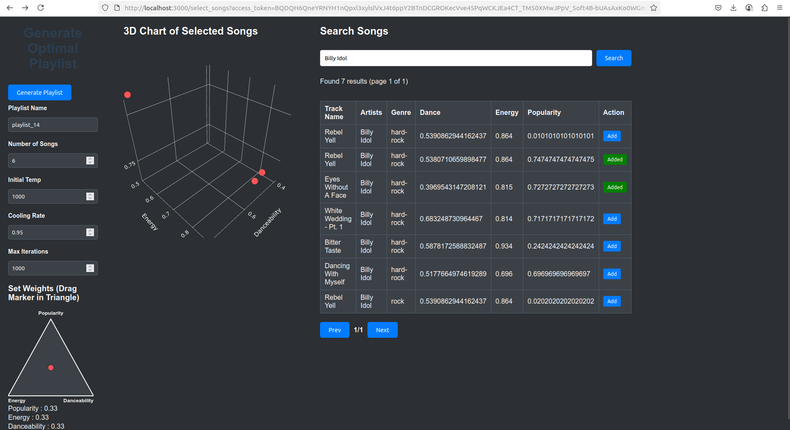
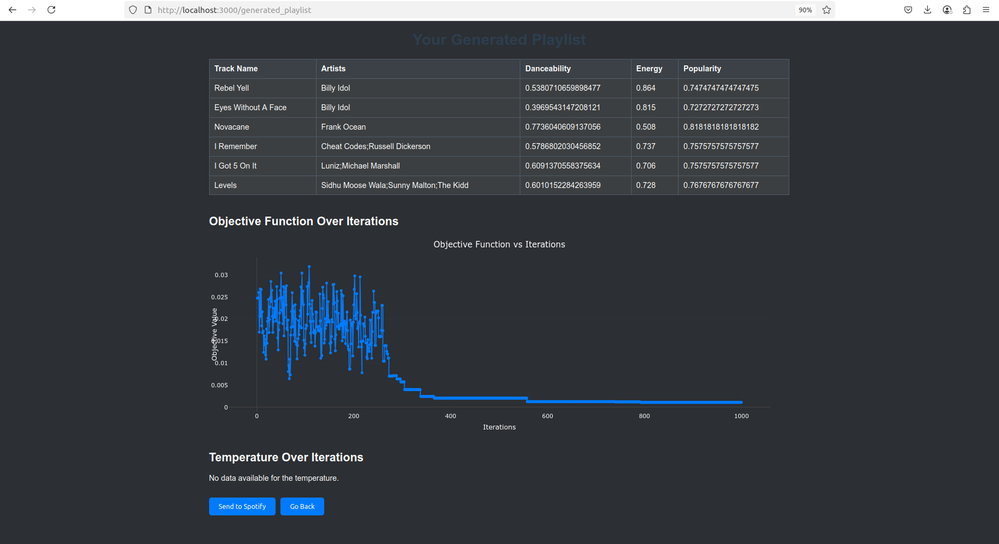

# Spotify Playlist Generator 🎵

## 📌 Project Overview 
Spotify Playlist Generator is an application that generates optimal playlists using a **simulated annealing algorithm** and a provided dataset. The application consists of a backend written in **Python** and a frontend built with modern web technologies, and allows users to directly export the generated playlists to their Spotify account.
 
 
## 🖼️ Preview
<p align="center">
  
  <br>
  <em>Fig. 1 – Playlist generator view</em>
</p>

<p align="center">
  
  <br>
  <em>Fig. 2 – Generated result</em>
</p>

## 📂 Project Structure 
```
SpotifyPlaylistGenerator/
│── app.py                  # Main backend application
│── dataset.csv             # Music dataset
│── frontend/               # User interface 
│── requirements.txt        # Python dependencies
│── simulated_annealing.py  # Optimization algorithm implementation
│── static/                 # Static files (CSS, JS)
└── media/                  # Images
```

## 🔧 Installation and Setup

### 1. Clone the repository

### 2. Install dependencies

pip install -r requirements.txt

### 3. Launch the application

You'll need two terminal windows — one for the frontend and one for the backend.

- Terminal 1: Frontend (React)
```
cd frontend
npm install       # only the first time
npm start         # starts the frontend at http://localhost:3000
```

- Terminal 2: Backend (Flask)
```
python3 app.py    # starts the backend at http://localhost:5000
```

Once both are running, open your browser and follow the link to authorize via Spotify when prompted.


## 🛠️ Technologies Used 
- **Python**
- **JavaScript**
- **Simulated Annealing** (optimization algorithm)
- **Spotify Web API** 